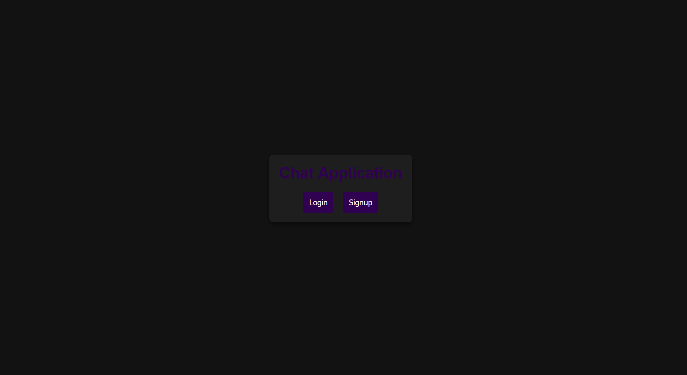
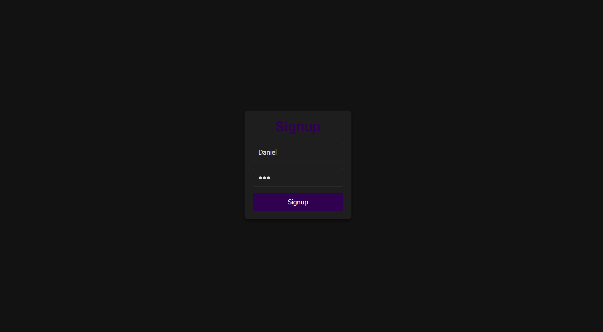
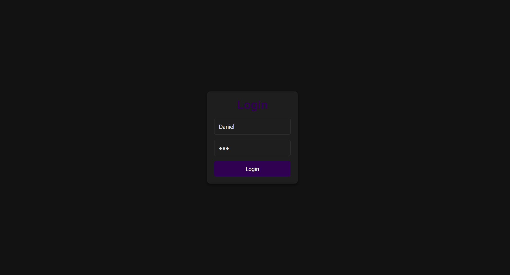
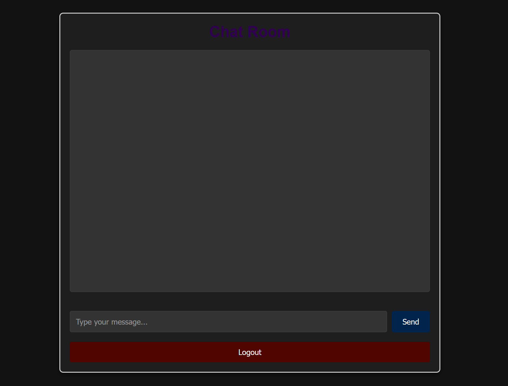
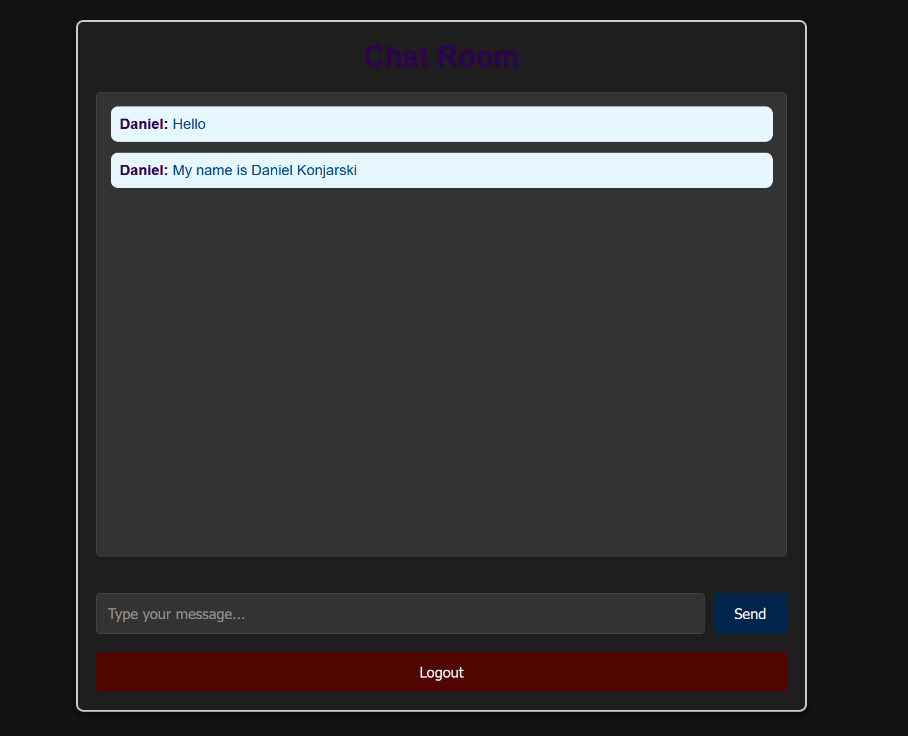
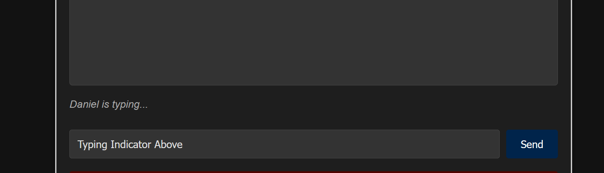
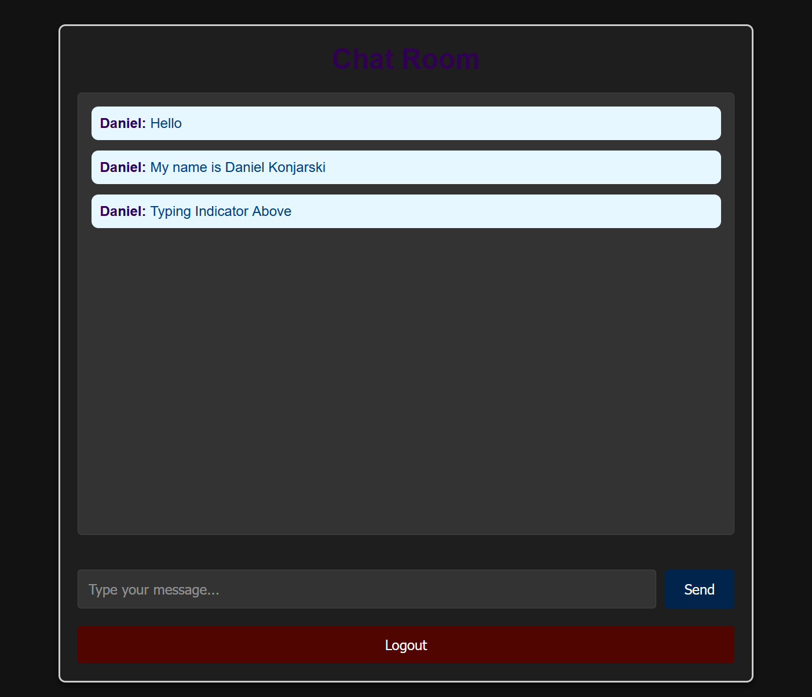

# Real-Time Chat Application

## Daniel Konjarski - 101436648

## COMP 3133 – Lab Test 1
**Due Date:** 5th Feb 2025 11:59 PM  

## Objective
This project is a real-time chat application that includes features such as user authentication, room-based messaging, and message persistence using MongoDB.

## Technologies Used
- **Backend:** Socket.io, Express.js, Mongoose
- **Frontend:** React, CSS, Bootstrap, Fetch API
- **Database:** MongoDB

## Features Implemented

### 1. GitHub Repository
- Repository Name: `101436648_lab_test1_chat_app`

### 2. Connect to the Chat Server
- Users can connect to the chat server to start using the application.

### 3. Signup Page (view/signup.html)
- Allows new users to create an account using a unique username.
- Stores user details in MongoDB.

### 4. Login Page (view/login.html)
- Authenticates existing users.

### 5. Join Room
- Users can join predefined chat rooms.

### 6. Leave Room
- Users can leave the room they are currently in by logging out.

### 7. Room-Based Chat
- Users can send and receive messages only within the joined room.
- Implements real-time communication using Socket.io.

### 8. Message Storage
- Stores all chat messages and user details in MongoDB.
- Messages can be either group messages (within a room) or private messages (between two users).

### 9. Typing Indicator
- Displays "User is typing..." whenever a user starts typing a message.

### 10. Logout Functionality
- Users can log out from the application.```

## Screenshots








